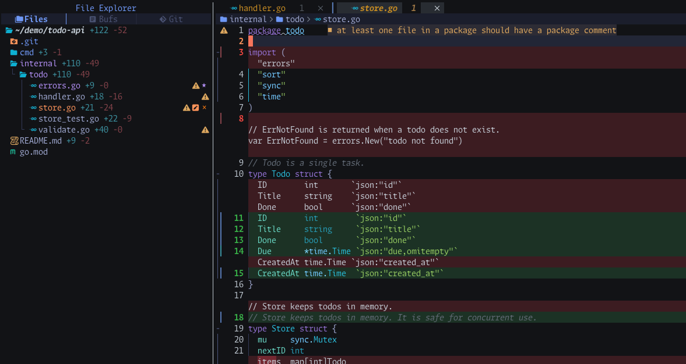
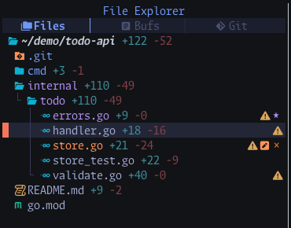

# diffbase.nvim

Choose what to diff against (your default branch, the previous commit, unpushed work, or any single
commit), and your **normal editing view** turns into a GitHub-style PR diff: green and red line backgrounds,
word diff, deleted lines, and `+added -removed` counts next to every file in neo-tree.

You get no diff tab and no new layout. You keep editing the same buffers in the same windows.

[日本語版 README](README.md)





## Features

- **Pick a base from a menu** (`:DiffBase`):
  - **main**: everything changed on this branch. It diffs against the merge-base with the default branch,
    which is detected automatically.
  - **previous**: the last commit (`HEAD~1`).
  - **unpushed**: work that is not pushed yet (merge-base with `@{upstream}`).
  - **Pick a commit…** (opt-in, `commit_view = true`): shows only what one commit changed (see
    [Commit view](#commit-view)).
  - **Off** (shown while a base is set).
  - Any other ref through `:DiffBase ref <ref>` or `require("diffbase").set(ref)`.
- **gitsigns.nvim** (optional) is pointed at the same base. While diffbase is on, it turns on line
  highlights, number highlights, word diff and deleted lines. Turning diffbase off restores the toggles and
  the global base you had before (see [Known limitations](#known-limitations)).
- **neo-tree.nvim** (optional):
  - Shows `+added -removed` next to every changed file. Directories show the total of everything under
    them, and binary files show `bin`.
  - Optionally (`neotree = { git_base = true }`), its own git markers (M/A) use the same base. This is off
    by default because of neo-tree bugs (see [Known issue](#neo-tree-git-markers-go-blank)).
- **New files are fully green**, including untracked files that were never `git add`ed. This works without
  gitsigns.
- **Untracked files are counted** as added lines. Submodules are not counted: their changes are not lines
  of this repository.
- **Statusline string** such as `Δ main +120 -34`.
- **GitHub-like palette**, with dark and light variants chosen from `'background'`. diffbase saves your
  highlight groups when it turns on and restores them when it turns off.
- **Async and debounced.** Stats are computed with `vim.system` and never block editing. Results that
  arrive after the base has changed are dropped.
- **No default keymaps.**

## Requirements

- Neovim >= 0.10
- git >= 2.24 (`:checkhealth diffbase` checks it)
- A Unix-like OS (macOS, Linux). diffbase passes `/dev/null` to git, so Windows is not supported.
- Optional: [gitsigns.nvim](https://github.com/lewis6991/gitsigns.nvim) (v1 or v2) for line and word
  highlights. diffbase waits for gitsigns' completion callback of each base change (gitsigns v0.8 and
  newer call it).
- Optional: [neo-tree.nvim](https://github.com/nvim-neo-tree/neo-tree.nvim) for counts in the file tree.
  The counts work with any build. If you opt in to `neotree = { git_base = true }`, **use neo-tree 3.42.0
  or newer**: its first release with commit `6679b93` (2026-08-05, PR #2072, "use correct argument order
  for git_base callback").
  Older builds fail with `attempt to index local 'git_status' (a boolean value)` on every render whenever
  any git base is set, including a plain `:Neotree git_base=HEAD~1` without diffbase. diffbase detects
  such a build and then does not set neo-tree's git base (it warns once, and `:checkhealth diffbase` shows
  a warning). Current builds have another problem with a git base set on an open tree; see
  [neo-tree git markers go blank](#neo-tree-git-markers-go-blank).

Without gitsigns or neo-tree, diffbase still provides the new-file highlight, the stats API, the
statusline string and the commands.

## Installation

### lazy.nvim

```lua
{
  "imutaroh/diffbase.nvim",
  cmd = "DiffBase",
  keys = {
    { "<leader>gn", function() require("diffbase").pick() end, desc = "Diff against… (diffbase)" },
  },
  opts = {},
}
```

### vim.pack (Neovim 0.12+)

```lua
vim.pack.add({ "https://github.com/imutaroh/diffbase.nvim" })
require("diffbase").setup()
vim.keymap.set("n", "<leader>gn", function() require("diffbase").pick() end, { desc = "Diff against… (diffbase)" })
```

You can skip `setup()`. diffbase uses the defaults on first use.

See `:help diffbase` for the full reference. lazy.nvim and `vim.pack` generate the help tags for plugins
they clone. For a local checkout (lazy.nvim `dir =` or `dev = true`), run `:helptags ALL` once.

## Recommended setup

```lua
-- lazy.nvim
return {
  {
    "imutaroh/diffbase.nvim",
    cmd = "DiffBase",
    keys = {
      { "<leader>gn", function() require("diffbase").pick() end, desc = "Diff against… (diffbase)" },
    },
    opts = {
      -- default_branch = "origin/develop", -- if auto-detection picks the wrong branch
    },
  },

  -- Optional: +added -removed next to files in neo-tree.
  {
    "nvim-neo-tree/neo-tree.nvim",
    dependencies = { "nvim-lua/plenary.nvim", "MunifTanjim/nui.nvim", "imutaroh/diffbase.nvim" },
    opts = function(_, opts)
      return require("diffbase.integrations.neotree").setup_opts(opts)
    end,
  },

  -- Optional: line and word highlights. Your own gitsigns settings are restored when diffbase turns off.
  { "lewis6991/gitsigns.nvim", opts = {} },
}
```

If you already have a neo-tree spec, add `"imutaroh/diffbase.nvim"` to its `dependencies` and call
`setup_opts()` from its `opts` instead (lazy.nvim merges both specs either way). As a dependency, diffbase
loads whenever neo-tree does (at startup, unless you lazy-load neo-tree), so `cmd = "DiffBase"` only defers
loading when you skip the neo-tree integration.

gitsigns' hunk navigation (`require("gitsigns").nav_hunk("next")`) follows the base diffbase set, so you
can jump through the changes of the whole branch.

### neo-tree wiring

`setup_opts(opts)` patches neo-tree's setup options. You can call it more than once with the same result.

- It registers a `diffbase` component for every built-in source (`filesystem`, `buffers`, `git_status`,
  `document_symbols`) and for each plain source name in `opts.sources`. The `file` and `directory`
  renderers it patches are shared by these sources, and neo-tree shows "Component diffbase not found."
  in a source that renders them without the component.
- It inserts `{ "diffbase", zindex = 10 }` right after `name` inside the `container` of the `file` and
  `directory` renderers.
- If you have not configured `renderers.file` or `renderers.directory`, it copies neo-tree's defaults
  first. If you have configured them, it patches yours, including source-specific renderers.

If you prefer to wire it by hand:

```lua
local diffbase_tree = require("diffbase.integrations.neotree")
require("neo-tree").setup({
  -- Register it in every source that uses these renderers.
  filesystem = { components = { diffbase = diffbase_tree.component } },
  buffers = { components = { diffbase = diffbase_tree.component } },
  git_status = { components = { diffbase = diffbase_tree.component } },
  renderers = {
    file = {
      -- ...
      { "container", content = {
        { "name", zindex = 10 },
        { "diffbase", zindex = 10 },
        -- ...
      } },
    },
    -- The same entry in `directory` shows the totals of directories.
    directory = {
      -- ...
      { "container", content = {
        { "name", zindex = 10 },
        { "diffbase", zindex = 10 },
        -- ...
      } },
    },
  },
})
```

By default diffbase only redraws neo-tree so the counts follow every change; neo-tree's own git markers
keep showing changes against `HEAD`. With `neotree = { git_base = true }`, diffbase also sets neo-tree's
git base (`git_base_by_worktree`, and the legacy `git_base`) and refreshes its git status, so that
neo-tree's M/A markers match. When diffbase turns off, it puts back whatever was there before (for example
a base you set with `:Neotree git_base=main`), or removes the entry if there was none. A neo-tree window
opened after you turned diffbase on also gets the base.

**Known issue in neo-tree (only with `git_base = true`):** on current neo-tree builds, setting or clearing
the git base of a tree that is already open blanks neo-tree's git markers (M, ?, ✗) until the output of
`git status` changes. See [neo-tree git markers go blank](#neo-tree-git-markers-go-blank). This is why
`git_base` is off by default.

### Statusline (lualine)

Add the component to your existing `lualine_x` (this example keeps lualine's defaults after it):

```lua
require("lualine").setup({
  sections = {
    lualine_x = {
      {
        function() return require("diffbase").status() end,
        cond = function() return package.loaded["diffbase"] ~= nil and require("diffbase").status() ~= "" end,
      },
      "encoding",
      "fileformat",
      "filetype",
    },
  },
})
```

`status()` returns:

| State | Example |
| --- | --- |
| off | `""` |
| a base is set | `Δ main +120 -34`, `Δ previous +5 -2`, `Δ HEAD~2 +6 -2` |
| a ref that has the name of a base | `Δ ref:main +5 -1` (`:DiffBase ref main`: the branch tip, not the `main` base's merge-base) |
| commit view | `Δ commit 9cce4ec +5 -1` |
| off, but still in commit view | `Δ detached (from feature)` |

The counts appear once the first async computation finishes.

## Commands

| Command | Action |
| --- | --- |
| `:DiffBase` / `:DiffBase pick` | Open the menu |
| `:DiffBase main` | Diff against the merge-base with the default branch |
| `:DiffBase previous` | Diff against `HEAD~1` |
| `:DiffBase unpushed` | Diff against the merge-base with `@{upstream}` |
| `:DiffBase <name>` | Any base defined in `bases` |
| `:DiffBase ref <ref>` | Diff against any git ref (completes `HEAD`, branches, remote branches, tags) |
| `:DiffBase commit` | Pick a commit and view only its changes (detaches HEAD; needs `commit_view = true`) |
| `:DiffBase back` | Leave commit view, return to your branch, and turn off |
| `:DiffBase off` | Turn off (does **not** leave commit view) |
| `:DiffBase refresh` | Recompute the stats (debounced) |

The subcommands `pick`, `commit`, `back`, `off`, `refresh` and `ref` are checked first, so a base with one
of those names cannot be reached as `:DiffBase <name>`.

### Commit view

Commit view is opt-in because it changes your checkout. Enable it with:

```lua
require("diffbase").setup({ commit_view = true })
```

This adds **Pick a commit…** to the menu and enables `:DiffBase commit` (while it is off, that command only
warns how to enable it). Picking a commit switches the repository to it with `git switch --detach` and
diffs against its parent. A root commit is diffed against the empty tree.

- **Which commits are listed:** the commits in `<default branch>..HEAD`. When that range is empty, the
  last `commit_list_limit` commits of `HEAD` are listed instead.
- **When it refuses:** if tracked files have uncommitted changes (staged or not), or a buffer of a file in
  the repository has unsaved changes, it refuses. Untracked files do not block it. While one repository is
  in commit view, neither commit view nor any other base can start in another one; run `:DiffBase back`
  first. Submodules are
  ignored for this check: `git switch` does not update submodule checkouts, so a submodule whose checkout
  no longer matches the viewed commit does not count as a change.
- **What is counted:** only what the commit changed. Untracked files in the working tree are not counted
  or highlighted as new while in commit view (whatever `include_untracked` says).
- **Picking again:** while in commit view, the list is built from the branch you will return to, not from
  the detached HEAD, so you can hop between commits of the branch.
- **Going back:** `:DiffBase back` (or the "Back to …" entry at the top of the menu) switches back to the
  branch, or the commit, you came from. It refuses while tracked files were changed or a buffer of the
  repository has unsaved changes.
- **Switching outside Neovim:** if HEAD is no longer detached at the viewed commit (for example after
  `git switch` in a terminal), diffbase considers commit view over: `back` and the next commit view never
  switch you away from where you are now. `back` then only warns and turns off.
- **Off while detached:** `:DiffBase off` turns the highlights off but leaves HEAD detached. The statusline
  then shows `Δ detached (from <branch>)`.
- **Quitting while detached:** diffbase does nothing when Neovim quits. If you quit Neovim while viewing a
  commit, run `git switch -` to return (or `git switch <branch>` if you hopped between several commits).

## API

```lua
local diffbase = require("diffbase")

diffbase.setup(opts?)          -- optional; see Configuration
diffbase.pick()                -- vim.ui.select menu
diffbase.set(ref, opts?)       -- -> boolean
diffbase.set_preset(name)      -- -> boolean; a name from `bases`
diffbase.view_commit()         -- commit picker
diffbase.back()                -- -> boolean; leave commit view
diffbase.off()
diffbase.refresh()             -- debounced
diffbase.get()                 -- -> { base, label, name, root, detached_from }
diffbase.stats(path?)          -- -> { added, removed, binary, new } | nil
diffbase.status()              -- -> string
```

- **`set(ref, opts?)`**
  - `ref` is a git ref string, or `function(ctx) return ref end` where `ctx = { root, default_branch }`.
    The special ref `"@default"` means the detected default branch.
  - `opts.merge_base` (boolean) diffs against `git merge-base <ref> HEAD` instead of `ref` itself.
  - `opts.label` is the menu and notification text, and `opts.name` is the short name for `status()`.
    Both default to the ref. `"@default"` and a function ref default to the ref they resolve to (for
    example `origin/main`). A ref with the same name as a configured base defaults to `ref:<ref>`, so it
    is not mistaken for that base in the statusline or the menu.
  - Returns `false`, with a warning, if the ref cannot be resolved, or while another repository is in
    commit view.
  - The ref is resolved to a commit once, when you set it. Later refreshes recompute the stats but keep
    that commit.
- **`get()`**
  - `base` is the commit diffed against. For a root commit in commit view it is the empty tree.
  - `root` is the normalized repository root.
  - `detached_from` is the branch (or commit) to return to while in commit view.
- **`stats(path?)`**
  - `path` defaults to the current buffer.
  - Directories return the total of everything under them. For directories, `binary` and `new` are
    always `false`.
  - Returns `nil` when diffbase is off or the path has no changes.
  - Paths are resolved with realpath, so symlinked checkouts work. A symlink that git tracks reports its
    own stats (as git sees it); a symlink from outside the repository into it reports its target's.
- **`_open_commit(root, sha, text?)`** opens commit view for `sha` without the picker. It is exposed for
  custom pickers and tests, and is not covered by API stability.

### Events

diffbase fires the `User` autocmd `DiffBaseChanged` with `data = require("diffbase").get()`:

- after each stats computation finishes (state is already updated at that point),
- after `off()`,
- after `back()`.

```lua
vim.api.nvim_create_autocmd("User", {
  pattern = "DiffBaseChanged",
  callback = function(ev)
    -- ev.data.base, ev.data.name, ...
    vim.cmd.redrawstatus()
  end,
})
```

### neo-tree integration module

```lua
local t = require("diffbase.integrations.neotree")
t.setup_opts(opts)       -- -> opts
t.component(config, node, state)
t.set_base(root, base)   -- -> changed; base = nil restores the previous values
t.refresh(full)          -- full = re-read git status, else redraw
```

## Configuration

These are the defaults (from `lua/diffbase/config.lua`):

```lua
require("diffbase").setup({
  default_branch = nil, -- nil = auto-detect: origin/HEAD, then origin/main, origin/master, main, master
  bases = { -- menu order; `ref` may be a function(ctx) -> ref
    { name = "main", label = "Changes on this branch (vs default branch)", ref = "@default", merge_base = true },
    { name = "previous", label = "Last commit", ref = "HEAD~1" },
    { name = "unpushed", label = "Not pushed yet", ref = "@{upstream}", merge_base = true },
  },
  commit_view = false, -- opt-in: "Pick a commit…" and :DiffBase commit (detaches HEAD)
  commit_list_limit = 20, -- used only when <default branch>..HEAD is empty
  include_untracked = true, -- count untracked files and highlight them as new (not in commit view)
  gitsigns = { enabled = true, linehl = true, numhl = true, word_diff = true, show_deleted = true },
  neotree = { git_base = false }, -- also set neo-tree's own git base (see Known issues)
  new_file_highlight = true, -- paint every line of files that do not exist in the base
  -- GitHub-style: new side green, old side red; the stronger shade marks changed words.
  colors = {
    dark = {
      new_line = "#1f3d2b",
      new_word = "#2f6f47",
      new_fg = "#3fb950",
      old_line = "#4a1f27",
      old_word = "#8b2f3c",
      old_fg = "#f85149",
    },
    light = {
      new_line = "#dafbe1",
      new_word = "#aceebb",
      new_fg = "#1a7f37",
      old_line = "#ffebe9",
      old_word = "#ffcecb",
      old_fg = "#cf222e",
    },
  },
  stat_format = nil, -- function(stat) -> string | { { text, highlight }, ... }
  refresh_events = { "BufWritePost", "FocusGained" },
  debounce_ms = 150,
})
```

How options are merged and checked:

- Tables are deep-merged with the defaults, so `colors = { dark = { new_line = "#123456" } }` changes one
  color only.
- `bases` and `refresh_events` are lists. If you set them, they **replace** the defaults; they are not
  merged.
- `colors = false` leaves all highlight groups alone.
- If any option has the wrong type (palette colors included: each must be a string or a number), or
  `commit_list_limit` is not a positive integer, or `debounce_ms` not an integer >= 0, diffbase shows one
  warning that lists every problem, and uses **all** defaults.
- A color string that Neovim does not accept (for example a misspelled color name) produces one warning;
  the affected groups are left as they are and everything else still works.
- Unknown keys (top level, and inside `gitsigns` / `neotree`) produce one warning, shown once per session.

What each option does:

| Option | Meaning |
| --- | --- |
| `default_branch` | Ref used for `"@default"`, for example `"origin/develop"`. |
| `bases[].name` | Short name, used by `:DiffBase <name>` and `status()`. |
| `bases[].label` | Menu text. |
| `bases[].ref` | A ref string, `"@default"`, or `function(ctx)` returning a ref. |
| `bases[].merge_base` | Diff against the merge-base with `HEAD`. |
| `commit_view` | Enable [commit view](#commit-view) (`git switch --detach`). Off by default. |
| `gitsigns.*` | Which gitsigns toggles to turn on. Only the ones set to `true` are saved and restored. |
| `neotree.git_base` | Also set neo-tree's git base and refresh its git status, so its M/A markers use the same base. Off by default because of neo-tree bugs (see [Known issues](#neo-tree-git-markers-go-blank)). Either way diffbase redraws neo-tree (only if it is already loaded) so the component's counts follow every change. |
| `stat_format` | Customizes the neo-tree text. Return a string (shown with `NeoTreeDimText`; `""` hides it) or a list of `{ text = ..., highlight = ... }` chunks. |
| `refresh_events` | Autocmd events that trigger a debounced recompute while on. `{}` disables them. |

Example `stat_format`:

```lua
stat_format = function(s)
  if s.binary then return " bin" end
  return { { text = (" %d/%d"):format(s.added, s.removed), highlight = "Comment" } }
end
```

## Highlights

| Group | Default | Used for |
| --- | --- | --- |
| `DiffBaseNewLine` | links to `DiffAdd` | Line background of files absent in the base |
| `DiffBaseNewNr` | links to `DiffAdd` | Line number of those files |

When `colors` is not `false`, diffbase does the following while it is on:

- It saves the current definitions of the groups below, then paints them with the palette.
- It paints `DiffBaseNewLine` and `DiffBaseNewNr` too, so the palette overrides your own definition of
  those groups while it is on.
- On `ColorScheme`, or when `'background'` changes, it saves the groups again and repaints them (on the
  next event-loop turn; see [Known limitations](#known-limitations)).
- When it turns off, it restores the saved definitions exactly. A group that was undefined stays
  undefined.

These are the gitsigns groups it paints:

- `new_line`: `GitSignsAddLn`, `GitSignsChangeLn`, `GitSignsChangedeleteLn`, `GitSignsUntrackedLn`
- `new_word`: `GitSignsAddLnInline`, `GitSignsChangeLnInline`, `GitSignsAddInline`, `GitSignsChangeInline`,
  `GitSignsAddVirtLnInline`, `GitSignsChangeVirtLnInline`
- `old_line`: `GitSignsDeleteLn`, `GitSignsTopdeleteLn`, `GitSignsDeleteVirtLn`
- `old_word`: `GitSignsDeleteLnInline`, `GitSignsDeleteInline`, `GitSignsDeleteVirtLnInline`,
  `GitSignsDeleteVirtLnInLine`
- `new_fg` (bold): `GitSignsAddNr`, `GitSignsChangeNr`, `GitSignsChangedeleteNr`, `GitSignsUntrackedNr`
- `old_fg` (bold): `GitSignsDeleteNr`, `GitSignsTopdeleteNr`

The neo-tree counts use `NeoTreeGitAdded`, `NeoTreeGitDeleted` and `NeoTreeDimText`.

## Health

Run `:checkhealth diffbase`. It reports:

- the Neovim version, and the git version (an error below 2.24),
- whether gitsigns and neo-tree are present (with versions when installed through lazy.nvim),
- the current repository and the detected default branch,
- the active base, and whether you are still in commit view.

The repository is taken from the active diffbase state, else the buffer you ran `:checkhealth` from, else
the current directory.

With lazy-loading (`cmd = "DiffBase"`, and without the neo-tree integration, which loads diffbase with
neo-tree), lazy.nvim only exposes a plugin's health check after the plugin has loaded, so
`:checkhealth diffbase` reports "No healthcheck found" until then. Run `:DiffBase off` (a
no-op when off) or `:Lazy load diffbase.nvim` first. Loading it eagerly (`lazy = false`) is also cheap:
the startup script only defines the `:DiffBase` command.

## Known limitations

- **Buffer-local gitsigns base:** a base set for one buffer with `:Gitsigns change_base` (without
  `global`) is reset by `:DiffBase off`. diffbase restores only the global base.
- **Files absent from the base:** a file that does not exist in the base (for example one added in the
  viewed commit) may show a stale gitsigns hunk until the buffer is reloaded (`:edit`). diffbase's own
  new-file highlight is correct.
- **Colorscheme and diffbase in one command line:** after `:colorscheme X | DiffBase off` (or
  `| DiffBase <base>`), turning off restores the previous scheme's `GitSigns*` definitions. Run them as
  separate commands.
- **Quitting in commit view:** diffbase does not switch back when Neovim quits. Run `git switch -` to
  return.
- **`:DiffBase` outside a git repository:** the base menu still opens; the "not inside a git repository"
  warning appears only after you choose an entry. `:DiffBase main` and the other subcommands warn right
  away.

## FAQ

### How is this different from diffview.nvim?

diffview.nvim opens a dedicated tab with side-by-side diff windows and a file panel, which is great for
reviewing. diffbase changes nothing about your layout. You keep editing real buffers, and the diff is drawn
on top of them as highlights, plus counts in the file tree you already use. You can use both.

### How is this different from gitsigns' `change_base` alone?

`change_base` is what diffbase uses for the line highlights. On top of it, diffbase adds:

- presets that resolve to a merge-base (whole-branch changes, unpushed work), with default-branch
  detection,
- turning linehl, numhl, word_diff and show_deleted on together and restoring your own values afterwards,
- a palette that is applied and later restored,
- `+added -removed` counts in neo-tree, and optionally neo-tree's own git markers on the same base (but see
  the known issue below),
- untracked files counted and highlighted as new,
- a new-file highlight that works without gitsigns,
- commit view (one commit against its parent, then back),
- a statusline string and a `DiffBaseChanged` event.

### neo-tree shows `attempt to index local 'git_status' (a boolean value)`

This only matters with `neotree = { git_base = true }`. Your neo-tree is older than 3.42.0 (commit
`6679b93`), which fixed setting a git base. Update neo-tree, or go back to the default `git_base = false`. You can confirm it is
unrelated to diffbase with a plain `:Neotree git_base=HEAD~1`. diffbase recognizes the affected builds and
does not set the base on them; `:checkhealth diffbase` warns about it.

### neo-tree git markers go blank

This only happens with `neotree = { git_base = true }`. On current neo-tree builds (tested at `ffdf8d9`),
setting or clearing a git base on a tree that is already open empties neo-tree's git status: the M, ?, ✗
markers disappear, the Git tab says "working tree clean", and after `:DiffBase off` the markers stay blank
until the output of `git status` changes (for example when you create or edit a file). The same happens without diffbase: run `:Neotree show`, then
`:Neotree show git_base=HEAD~1`. The cause is in neo-tree (when the `git status` output is unchanged, its
cached path passes an empty status table on), so diffbase cannot work around it. If the markers matter to
you, keep the default `git_base = false`: diffbase then never touches neo-tree's git base, and the
`+added -removed` counts keep working.

### "no upstream branch is configured for '<branch>'"

The `unpushed` base needs an upstream. Set one with `git push -u` or `git branch --set-upstream-to`.
Related messages:

- "the upstream branch '<remote>/<branch>' of '<branch>' is gone (deleted on the remote)": the upstream
  was deleted and pruned. Push the branch again with `git push -u`, or set another upstream.
- "HEAD is detached; 'unpushed' needs a branch with an upstream": switch to a branch first.

### The `main` base picked the wrong branch

Set `default_branch = "origin/develop"` (or any ref), or fix `origin/HEAD` with
`git remote set-head origin --auto`.

### Does it touch my repository?

Only commit view changes anything: it runs `git switch --detach <commit>`, and later
`git switch <your branch>` for `back`. Every other git call is read-only, and the stats computation runs
with `GIT_OPTIONAL_LOCKS=0` so it does not take git's optional locks.

## License

MIT. See [LICENSE](LICENSE).
